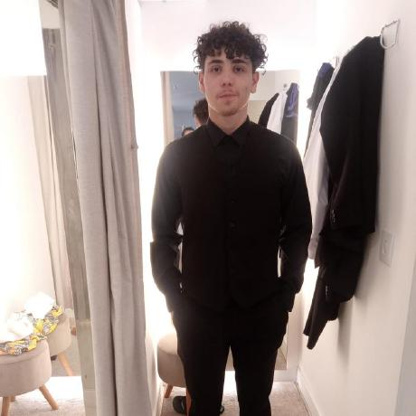

# RAILLIFE

**Alunos:** Mateus de Lima dos Santos, Renato L. Vicente, Arthur Roeder e Gustavo Henrique Fenske.

</img>

## Descrição

O RAILLIFE é um projeto Ferroramas para gerenciamento ferroviário, com sistema CRUD para rastreamento de trens e sensores em um banco de dados relacional. A metodologia utilizada neste projeto será a Espiral com Scrum como metodologia agil.

## Tarefas iniciais

 * [x] Atualização do README.md
 * [x] Refatoração da tela de cadastro
 * [x] Refatoração da tela de login
 * [x] Frontend da tela de cadastro
 * [x] Frontend da tela de login
 * [x] Backend da tela de cadastro
 * [x] Backend da tela de login
 * [ ] Frontend da tela de gerenciamento de usuários
 * [ ] Backend da tela de gerenciamento de usuários

## Contribuições 

Agradecemos às seguintes pessoas que contribuíram para este projeto:

<table>
    <tr>
        <td>

            Img Arthur Roeder</img> 
            
                <b> Arthur Roeder</b>
            
        </td>
        <td>

            Img Gustavo Fenske</img> 
            
                <b>Gustavo Fenske</b>
            

        </td>
        <td>

            Img Mateus Lima</img> 
            
                <b>Mateus Lima</b>
            

        </td>
        <td>

            Img Renato Lorenzo</img> 
            
                <b>Renato Lorenzo</b>
            

        </td>
    </tr>

</table>
 

